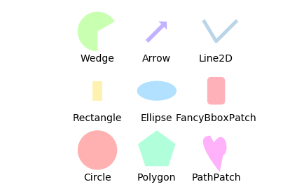

## matplotlib笔记（一）

```python
import matplotlib.pyplot as plt
import numpy as np
import pandas as pd
import math
```


<!--more-->
```python
t2 = pd.read_table('t2.txt',sep="\t",header=None,low_memory=False)
t2["c"] = t2[3].map(lambda x: x*1000/sum(t2[3])).map(lambda x : int(x))
t2["f"] = t2[1]-121163321
t2["g"]=t2[2]-121163321
t2['d']=t2["c"]/t2[3]
t2['a']=t2['f']*t2['d']
t2['b']=t2['g']*t2['d']
t2['a1']=t2['a'].map(lambda x: int(x+10))
t2['b1']=t2['b'].map(lambda x: int(x+10))
t3 = t2[[0,"a1","c"]]
t3.loc[3,0]='UTR5'
t3.loc[4,0]='UTR3'
```

    d:\python37\lib\site-packages\pandas\core\indexing.py:543: SettingWithCopyWarning: 
    A value is trying to be set on a copy of a slice from a DataFrame.
    Try using .loc[row_indexer,col_indexer] = value instead
    
    See the caveats in the documentation: http://pandas.pydata.org/pandas-docs/stable/indexing.html#indexing-view-versus-copy
      self.obj[item] = s
    


```python
fig, ax = plt.subplots()
ax.set_xlim([0, 800])
ax.set_ylim([0, 800])

def get_cmap(n, name='hsv'):
    return plt.cm.get_cmap(name, n)

cmap = get_cmap(t3.shape[0])

for i in range(t3.shape[0]):
    rect = plt.Rectangle((t3.loc[i]["a1"], 5), t3.loc[i]["c"], 50, color= cmap(i), alpha=0.6)
    ax.add_patch(rect)

plt.axis('equal')
plt.axis('off')
plt.tight_layout()
plt.savefig('plot1.png', dpi=700)
```


```python
fig, ax = plt.subplots()

ax.set_xlim([0, 1000])
ax.set_ylim([0, 1000])


rect = plt.Rectangle((10, 5), 12, 70, color = 'g', alpha=0.5)
ax.add_patch(rect)
rect = plt.Rectangle((20, 5), 5, 70, color='b', alpha=0.4)
ax.add_patch(rect)
rect = plt.Rectangle((682, 5), 27, 70, color='r', alpha=0.8)
ax.add_patch(rect)
rect = plt.Rectangle((725, 5), 247, 70, color='k', alpha=0.6)
ax.add_patch(rect)

plt.axis('equal')
plt.axis('off')
plt.tight_layout()

#plt.savefig('plot1.png', dpi=700)

# plt.show()
```


```python
import matplotlib.pyplot as plt
import matplotlib.patches as mpatches

fig, ax = plt.subplots()

rectangle = mpatches.Rectangle(xy=(1.0, 1.0), width=1.0, height=0.50)
ax.add_patch(rectangle)

ax.set_xlim([0, 3])
ax.set_ylim([0, 3])

shadow = mpatches.Shadow(rectangle, ox=0.20, oy=-0.10)
shadow.set_zorder(rectangle.get_zorder() - 1)  # draw *shadow* below *rectangle* 
ax.add_patch(shadow)
plt.show()
# fig.savefig("shadow.png")
```


```python
fig = plt.figure()
ax = fig.add_subplot(1, 1, 1)
rect = plt.Rectangle((0.2, 0.75), 0.4, 0.15, color='k', alpha=0.3)
circ = plt.Circle((0.7, 0.2), 0.15, color='b', alpha=0.3)
pgon = plt.Polygon([[0.15, 0.15], [0.35, 0.4], [0.2, 0.6]],color='g', alpha=0.5)

ax.add_patch(rect)
ax.add_patch(circ)
ax.add_patch(pgon)
plt.show()
```


```python
import matplotlib.pyplot as plt
import numpy as np
import matplotlib.path as mpath
import matplotlib.lines as mlines
import matplotlib.patches as mpatches
from matplotlib.collections import PatchCollection


def label(xy, text):
    y = xy[1] - 0.15  # shift y-value for label so that it's below the artist
    plt.text(xy[0], y, text, ha="center", family='sans-serif', size=14)


fig, ax = plt.subplots()
# create 3x3 grid to plot the artists
grid = np.mgrid[0.2:0.8:3j, 0.2:0.8:3j].reshape(2, -1).T

patches = []

# add a circle
circle = mpatches.Circle(grid[0], 0.1, ec="none")
patches.append(circle)
label(grid[0], "Circle")

# add a rectangle
rect = mpatches.Rectangle(grid[1] - [0.025, 0.05], 0.05, 0.1, ec="none")
patches.append(rect)
label(grid[1], "Rectangle")

# add a wedge
wedge = mpatches.Wedge(grid[2], 0.1, 30, 270, ec="none")
patches.append(wedge)
label(grid[2], "Wedge")

# add a Polygon
polygon = mpatches.RegularPolygon(grid[3], 5, 0.1)
patches.append(polygon)
label(grid[3], "Polygon")

# add an ellipse
ellipse = mpatches.Ellipse(grid[4], 0.2, 0.1)
patches.append(ellipse)
label(grid[4], "Ellipse")

# add an arrow
arrow = mpatches.Arrow(grid[5, 0] - 0.05, grid[5, 1] - 0.05, 0.1, 0.1,
                       width=0.1)
patches.append(arrow)
label(grid[5], "Arrow")

# add a path patch
Path = mpath.Path
path_data = [
    (Path.MOVETO, [0.018, -0.11]),
    (Path.CURVE4, [-0.031, -0.051]),
    (Path.CURVE4, [-0.115, 0.073]),
    (Path.CURVE4, [-0.03, 0.073]),
    (Path.LINETO, [-0.011, 0.039]),
    (Path.CURVE4, [0.043, 0.121]),
    (Path.CURVE4, [0.075, -0.005]),
    (Path.CURVE4, [0.035, -0.027]),
    (Path.CLOSEPOLY, [0.018, -0.11])]
codes, verts = zip(*path_data)
path = mpath.Path(verts + grid[6], codes)
patch = mpatches.PathPatch(path)
patches.append(patch)
label(grid[6], "PathPatch")

# add a fancy box
fancybox = mpatches.FancyBboxPatch(
    grid[7] - [0.025, 0.05], 0.05, 0.1,
    boxstyle=mpatches.BoxStyle("Round", pad=0.02))
patches.append(fancybox)
label(grid[7], "FancyBboxPatch")

# add a line
x, y = np.array([[-0.06, 0.0, 0.1], [0.05, -0.05, 0.05]])
line = mlines.Line2D(x + grid[8, 0], y + grid[8, 1], lw=5., alpha=0.3)
label(grid[8], "Line2D")

colors = np.linspace(0, 1, len(patches))
collection = PatchCollection(patches, cmap=plt.cm.hsv, alpha=0.3)
collection.set_array(np.array(colors))
ax.add_collection(collection)
ax.add_line(line)

plt.axis('equal')
plt.axis('off')
plt.tight_layout()

plt.show()
collection.set_array(np.array(colors))
```




